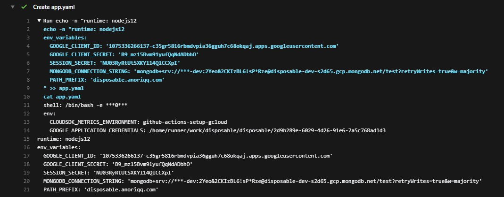

## GitHub Actions から環境変数をマスクして GAE にデプロイする

Google Cloud App Engine での環境変数の使い方にはいくつかの方法があります。

- app.yaml に記述してデプロイする
- デプロイ後にアプリケーションから読み込む

今回は`app.yaml`に記述する方法について書きます。

### 課題

`app.yaml`に環境変数をそのまま書く場合、公開リポジトリでは例えばシークレット等も公開してしまうことになります。  
そのため、リポジトリにシークレットを含めずに`app.yaml`を使ってデプロイします。

### 環境

- [App Engine Node.js Standard April 20, 2020](https://cloud.google.com/appengine/docs/standard/nodejs/release-notes?hl=ja#April_20_2020)
- [Github Actions v2.262.1](https://github.blog/changelog/2020-05-14-github-actions-new-runner-release-v2-262-1/)

```shell
❯ gcloud --version
Google Cloud SDK 292.0.0
alpha 2020.05.08
beta 2020.05.08
bq 2.0.57
core 2020.05.08
gsutil 4.50
kubectl 2020.05.08
```

### 選択肢

GCE や GKE を使うときには、Cloud Build でイメージをビルドする際にシークレットを Cloud KMS や Secret Manager から引っ張ってきていました。

しかし GAE はイメージのビルドまでやってくれるので、手を入れる隙がありません。  
そこで、CI でデプロイするタイミングで`app.yaml`を用意しすることにしました。

この方法を実現するためにいくつかの選択肢を考えました。

- Cloud KMS や Secret Manager から`app.yaml`をダウンロードする
- GitHub Actions に Secret を追加して、`app.yaml`を生成する

両方試した結果、最終的に選択したのは後者の方法です。

### 比較

詳しい手法は後に書きましたので、やり方が知りたい場合は読み飛ばしてください。

#### 1. Cloud KMS や Secret Manager から app.yaml をダウンロードする

最初に試したのはこちらです。

ポイントは

- 環境変数の管理が`app.yaml`ファイルだけで良くなるが、バージョン管理が必要
- 環境ごとにシークレットが必要
- シークレットの暗号化が必要
- API 利用が有料

この方法を採用しなかった理由は、実装している最中にシークレットを GitHub Actions のログに表示させることなく`app.yaml`を生成する方法が思いつかなかったからです。  
なので、個別にシークレットのバージョン管理する作業を受け入れることができる場合は問題なく機能します。

#### 2. GitHub Actions に Secret を追加して、app.yaml を生成する

今回採用したのがこちらです。

ポイントは

- 環境変数の管理は GitHub リポジトリの Secrets で行う
- `app.yaml`を生成するスクリプトを書く必要がある
- 無料

採用理由はひとつ目の方法ができないと思っていたからです。（なんて情けないんだ。）  
というのを差し置いてもやはり無料なので、選択する価値はあると思います。

### 環境変数を書き加えた app.yaml の作成方法

`app.template.yaml`というファイルを新規作成して、これを元に`app.yaml`を作ります。

```yaml:app.template.yaml
# app.template.yaml
runtime: nodejs12
env_variables:
  GOOGLE_CLIENT_ID: ${{GOOGLE_CLIENT_ID}}
  GOOGLE_CLIENT_SECRET: ${{GOOGLE_CLIENT_SECRET}}
  SESSION_SECRET: ${{SESSION_SECRET}}
  MONGODB_CONNECTION_STRING: ${{MONGODB_CONNECTION_STRING}}
  PATH_PREFIX: ${{PATH_PREFIX}}
```

あとは、このテンプレート部分を環境変数で置換して出力することで、デプロイ可能な`app.yaml`が完成します。

```js
// scripts/config-compile.js
#!/usr/bin/env node

/* eslint-disable */

const fs = require('fs');

const template = fs.readFileSync('app.template.yaml').toString();
let content = template;

for (const match of template.matchAll(/\${{([A-Z_]*)}}/g)) {
  const envName = `APP_${match[1]}`;
  content = content.replace(match[0], `'${process.env[envName]}'`);
}

fs.writeFileSync('app.yaml', content);
```

Node.js を使った置換を使いましたが、実行する際は Node.js のセットアップも必要になるので、Shell Script で書いても良いと思います。  
また、EJS などの既存のテンプレートエンジンを使っても良いですね。

GitHub リポジトリの Secrets で環境変数を管理するため、管理のしやすさを考えて`APP_`というプレフィックスをつけてます。

最後に、GitHub Actions からこのスクリプトを使って、テンプレートから`app.yaml`を作り、デプロイする job を作成します。

```yaml
# .github/workflows/test.yml
name: CI

on:
  push:
    branches: [master]
  pull_request:
    branches: [master]

jobs:
  test:
  # ここにテスト

  deploy:
    name: Deploy
    runs-on: ubuntu-latest
    needs: test
    if: github.ref == 'refs/heads/master'

    steps:
      - name: Checkout
        uses: actions/checkout@v2

      - name: Setup and Configure gcloud CLI
        uses: GoogleCloudPlatform/github-actions/setup-gcloud@master
        with:
          version: '292.0.0'
          project_id: ${{ secrets.GOOGLE_CLOUD_PROJECT_ID }}
          service_account_key: ${{ secrets.GOOGLE_APPLICATION_CREDENTIALS}}
          export_default_credentials: true

      - name: Setup Node.js
        uses: actions/setup-node@v1
        with:
          node-version: '12.x'

      - name: Load Secrets
        run: node ./scripts/config-compile.js
        env:
          APP_GOOGLE_CLIENT_ID: ${{ secrets.APP_GOOGLE_CLIENT_ID}}
          APP_GOOGLE_CLIENT_SECRET: ${{ secrets.APP_GOOGLE_CLIENT_SECRET}}
          APP_SESSION_SECRET: ${{ secrets.APP_SESSION_SECRET}}
          APP_MONGODB_CONNECTION_STRING: ${{ secrets.APP_MONGODB_CONNECTION_STRING}}
          APP_PATH_PREFIX: ${{ secrets.APP_PATH_PREFIX}}

      - name: Deploy App to App Engine
        run: gcloud app deploy
      - run: rm -f app.yaml
```

重要なポイントは、`Load Secrets`です。  
`env`で環境変数を渡して、スクリプトを実行します。  
さらに、job の最後で生成した`app.yaml`を削除しています。
キャッシュに保存されないようにするためです。

その他、テストをパスした master ブランチで実行するようにしました。

あとは適宜シークレットをリポジトリに追加して実行すればうまくいくはずです。

### 参考: 1 の方法

自戒を込めて。反省の章。

環境変数の管理方法について調べていたとき、便利そうなリポジトリを見つけました。

[GoogleCloudPlatform/github-actions/get-secretmanager-secrets](https://github.com/GoogleCloudPlatform/github-actions/tree/master/get-secretmanager-secrets)

お、使えそうじゃーんと思って、これを使って試していたのですが、復号化したシークレットをファイルに書き込む時にどうしても内容がログに残ってしまうんです。

[](https://github.com/anoriqq/disposable/runs/673500836)

mask 関数なども試してはみたもののすべてを隠すことはできず、どうにかできないかと考えていたところ、2 の方法を知りました。

そしてこの 1 の方法を使うには、Google が作ってくれた Action を使わずに、`gcloud`コマンドを一発叩けば終わります。

```shell
gcloud secrets versions access [バージョン] --secret='[シークレット]' >> app.yaml
```

なぜ思いつかなかったのか。とても悔しい。  
けれど、おかげで無料でやる方法を経験できたので良しとしました。

誰かの助けになれば幸いです。

### References

- [Google Cloud App Engine Environment Variables](https://dev.to/mungell/google-cloud-app-engine-environment-variables-5990)
- [Secrets in Google App Engine](https://www.dontpanicblog.co.uk/2019/04/27/secrets-in-google-app-engine/)
- [How to use Environment Variables in GCloud App Engine (Node.js)](https://medium.com/@gunar/how-to-use-environment-variables-in-gcloud-app-engine-node-js-86623b3ab0f6)
