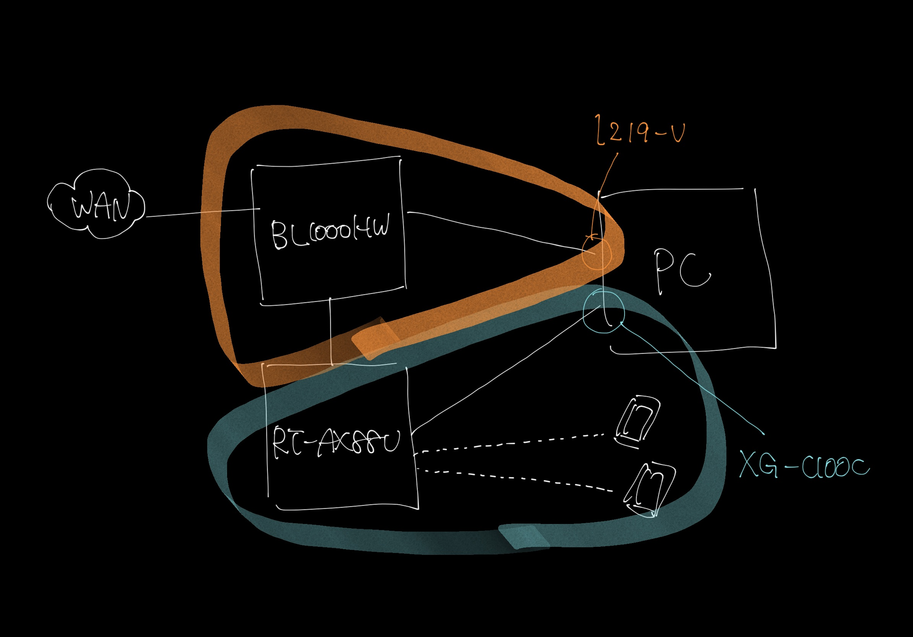
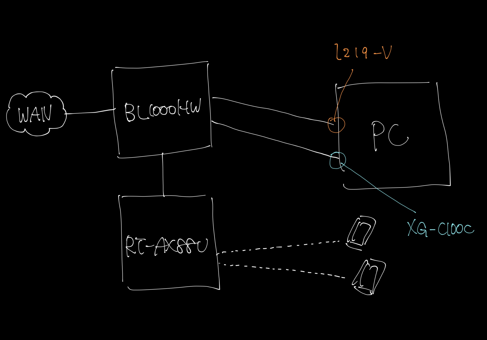
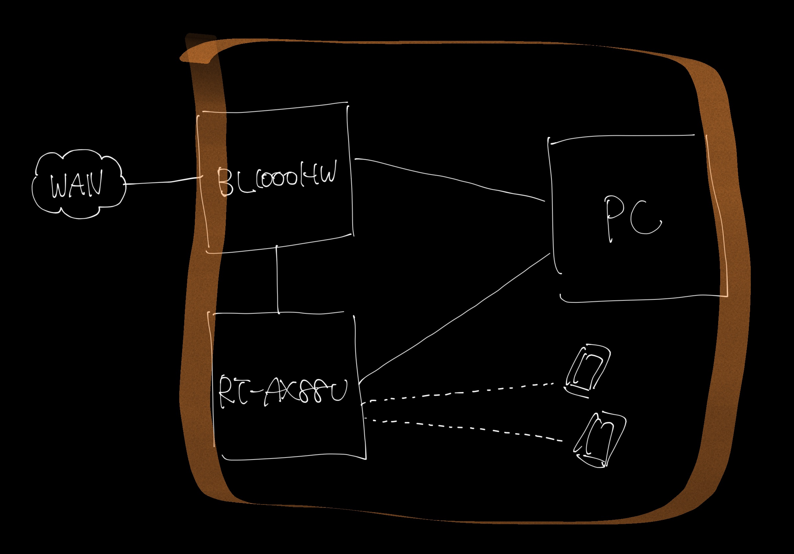
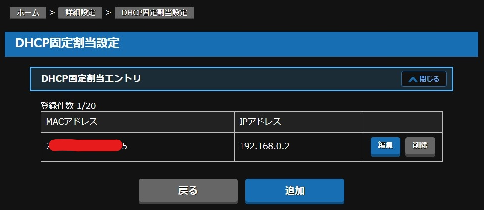
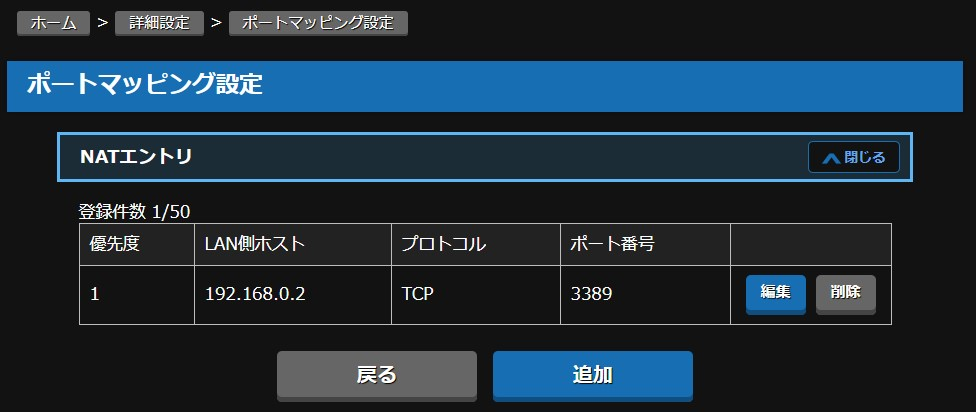

おそらく日本国内の個人契約で利用可能なインターネットサービスの中で最速なのが｢au ひかり ホーム 10 ギガ･5 ギガ｣だと思う。（僕調べ）  
サーバー側の速度が出せる場合は笑ってしまうくらいの速度が出る。

## やりたいこと

なにをするにもそこそこの処理能力と、笑えるくらいの速度があるマシンは心強い。  
やはり、iPad からリモートで作業したくなる。

やることは、

1. スリープ状態の母艦をリモートから起動できるようにする
2. リモートデスクトップが使えるようにする

## 前提

対象の母艦は以下の構成の自作 Windows マシン。

- OS: Microsoft Windows10 Pro
- MB: [ASUS ROG STRIX Z270F GAMING](https://www.asus.com/jp/Motherboards/ROG-STRIX-Z270F-GAMING/)
  - OnBoard NIC: [Intel `I219-V`](https://www.intel.co.jp/content/www/jp/ja/products/network-io/ethernet/controllers/connection-i219-v.html)
- NIC: [ASUS `XG-C100C`](https://www.asus.com/jp/Networking/XG-C100C/)

手持ちのルーターは

- NEC [`BL1000HW`](https://www.aterm.jp/kddi/1000hw/)
- ASUS [`RT-AX88U`](https://www.asus.com/jp/Networking/RT-AX88U/overview/)

## 課題

- `XG-C100C`は WoL をサポートしていない
- `BL1000HW`はルーター機能を無効にできない（最低限のカスタマイズしかできない）

## 結論

- `XG-C100C`の WAN は使わずに AP モードで動かす
- マジックパケットの送出は ASUS Router アプリから行う
- `BL1000HW`の DHCP 固定割当エントリで`XG-C100C`の IP アドレスを固定する
- `BL1000HW`の NAT エントリで ↑ で固定した IP アドレス宛のリモート接続用ポートをマッピングする

## 細かいはなし

今までの僕はゲーミング用途で`RT-AX88U`を使っていた。  
理由は最適化されたネットワークを簡単に利用できたから。

しかし最近はゲームはしなくなってしまった。  
だから思い切ってゲーミング特化機能を捨てて、リモート作業環境を手に入れることにした。

### 最初の構成

`BL1000HW`のルーターを引き剥がせれば 1 番良かったのかもしれないが、できなかったので LAN 内にルーターが 2 台ある状態。

### 片方のセグメントに 2 つの NIC をつなぐ

`XG-C100C`は 10Gbps のリンク速度と引き換えに WoL をサポートしていなため、`I219-V`を対象にマジックパケットを送出する必要があります。

しかし、`I219-V`に接続している`RT-AX88U`は WAN 側から見えないため対象の NIC を特定できません。  
そこで`RT-AX88U`ではなく`BL1000HW`と`I219-V`を接続して WAN 側からマジックパケットを送出してみました。

結論を言うと、この構成で WoL を機能させることはできませんできした。  
以下やったこと

- `BL1000HW`で PC の IP アドレスを固定する
- `BL1000HW`でマジックパケット用のポートを通過させるフィルターを追加する
- マジックパケット送出アプリをいろいろ試す

動かない原因が分からないので、まだ僕の知らない知識が隠れてそうです。

### 救世主 ASUS Router アプリ

iOS の App Store で｢WoL｣と検索すると多くのマジックパケット送出アプリがあるのですが、やけくそになってそれを片っ端から試していたわけです。
そんな迷走の中で｢ASUS Router｣というルーター管理アプリに Wake on Lan 機能があるのを見つけました。

早速一番最初の構成に戻して試したところ、機能せず。。。  
しかし、今までの WoL アプリとは雰囲気が違い、LAN 内にいないときも Router の情報を取得しているように見えたのです。

...これはいけるかもしれない!

### RT-AX88U を AP モードで動作させる

世界はひとつになった。

iPad を 4G でインターネットにつなぎ、ASUS Router アプリから`XG-C100C`宛てに WoL を実行すると、無事 PC は起動しました!

本当にどういう仕組なのだろう。もっと勉強しよう。

### RD Client アプリでリモートデスクトップ

アプリの使い方は[公式ドキュメント](https://docs.microsoft.com/ja-jp/windows-server/remote/remote-desktop-services/clients/remote-desktop-clients)が詳しい

ルーター`BL1000HW`の設定が必要だったのでぱぱっとやった。

- DHCP 固定割当エントリで`XG-C100C`の IP アドレスを固定する
  
- NAT エントリで ↑ で固定した IP アドレス宛のリモート接続用ポートをマッピングする
  

個人的なつまずきポイントは以下

#### PC Name にはポート番号も指定する必要がある

> PC の名前 – コンピューターの名前。 Windows コンピューター名、インターネット ドメイン名、または IP アドレスを指定できます。 PC の名前をポート情報を追加することもできます (たとえば、 MyDesktop:3389 または 10.0.0.1:3389)。
>
> > [リモート デスクトップ接続を追加する](https://docs.microsoft.com/ja-jp/windows-server/remote/remote-desktop-services/clients/remote-desktop-ios#add-a-remote-desktop-connection)

#### LAN 内と LAN 外では共通の設定を利用できない

僕は IP アドレスを指定した設定と、LAN 内の PC の名前を設定した 2 つを使い分けることにした。

## 素敵なリモートライフを!

ASUS Router アプリは WoL できるのに、それ以外のアプリではできない理由が分かる人はぜひ僕に教えていただけると嬉しいです。
