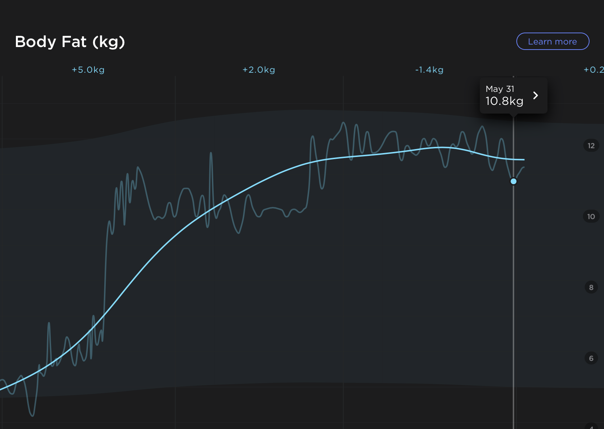

# 6 週間終わりました

5/31 日に無事終わりました。

最終日はそれどころじゃない気持ちだったので特に感慨深いとかないですね。

でも筋肉は増えたとので満足してます。  
6 パックにはならなかったです。

## 体組成の変化

体重は頑張って食べて増やしました。最近落ちてきてるのは食事のバランスを考え始めたからです。
とりあえず量食べれば良いってもんじゃなかった。

## これから

次の 6 週間が 6/1 から始まっています。  
体重を維持しつつ、体脂肪を 10%まで近づけます。

それに加えて 1 日あたり 1~2L の水分を摂取します。

あと、健康な体を持っていることに感謝します。  
ありがとうございます。
