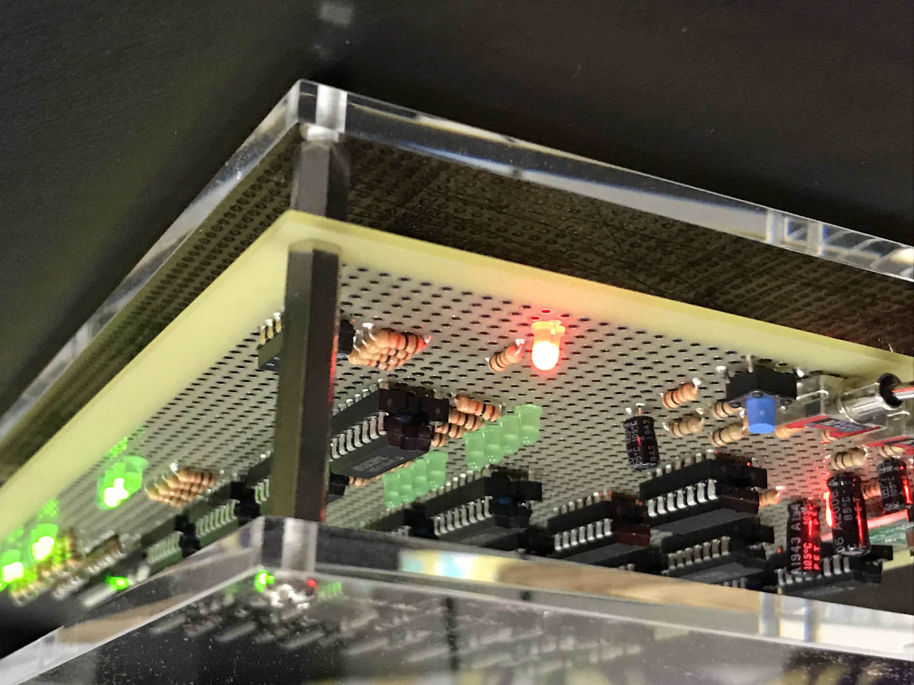

## メモリをどんな視点でみるのか

僕は自作PCをする民なので、メモリと言ったらHDDなどと比較して

- 読書速度が高速
- 揮発性である
- CPU/チップセット/OSによって実行速度と容量に上限がある
- オーバークロックできる

というような知識を持っていました。
ですがこのような記憶装置の種類というのは技術的な問題で分けられているだけなので、
たとえば、遅延なし! 読書速度が無限bit/s! 不揮発! コストゼロ! というような魔法技術モリモリの記憶装置が誕生すれば現代のような主記憶装置/補助記憶装置等々の区別はなくなるでしょう。（多分）

つまり、*コンピュータの一部としてのメモリ*の普遍的な知識として重要なのは

- デジタルデータの保存場所であるということ
- コンピューターの中でデジタルデータをどのように扱うか

だと思います。

つまり僕のように「メモリ操作が漠然と分からない」から、メモリについて勉強してもモヤモヤは残るでしょう。
残りのモヤモヤを解消するには「CPUがどのようにデジタルデータを扱うのか」を知ることだと思います。

CPUから見た**メモリ**よりもメモリを見ている**CPU**が大切。(同じことかも...?)

## CPUを知るにはつくるのが1番

つまりはそういうことです。

『CPUの創りかた』<渡波 郁 | マイナビ出版> がおすすめであると先人から耳にしたのでこちらを教科書として進めました。

この本は2003年出版なので、ICの情報は読む側で更新が必要になりますが、CPUそのものの考え方を学ぶにはとても良いと思いました。
時代性を感じる語り口で0年代前後の秋葉原が大好きな僕にとっては読むのがとても楽しかったです。

『CPUの創りかた』では**TD4**という4bit CPUを例にしてCPUを学んでいきます。
実際にパーツや工具を揃えて製作せずとも、読むだけで十分にポイントはつかめると思います。
とはいえ実際に製作すると、読むだけよりも多くの学びが得られるのでつくるのがおすすめです。
僕の場合は2週間強で製作しました。途中、電子の気持ちが知りたくなって精神的に半導体とにらめっこしてたので、電気の基礎知識がある場合や電子とかどうでもいいという場合はもっと早く完成させられると思います。

## 製作の記録

アルバムのリンク置いておきます。

[A9TD4 - Google フォト](https://photos.app.goo.gl/rgxqRKch7SWYUg9T7)

## TD4からA9TD4の変更点

### ロジックIC

- `540`は`04`を2つで代用しました
- `154`は`138`を2つで代用しました
- `10`は`00`を2ゲートで代用しました

全部合わせて15個のロジックICを使いました。

### 電源

- DC 5V一系統から、DC 5VとUSB type-c 5Vの2系統と切替スイッチをFETで実装しました
- DCDCコンバータを追加

ここの回路は自分で設計したので結構苦労しましたがその分楽しかったです。

### LED

- すべての`161`の出力
- クロック出力
- 電源
- PCの示すROMのアドレスと内容

LEDは動作確認が格段に楽になるので追加することをおすすめします。
あとかっこいい!!

## ものをつくるってやっぱり楽しい! -学んだこと-

少し感想かきます。

コンピュータの知識とか云々も良いけど、はやり自分の手によって生まれるものへ抱く特別な感情がたまりませんね。
ソフトウェアを完成させたときとも違う良さがあります。

さて、この経験を通して学んだことですが、たくさんあります。（たくさん寄り道したので）

- すべての情報は電圧で表現する
- LHの制御はすべて基本ロジックゲートからなる
- 物理的制約によりCPUの性能限界が決まる(ただしアーキテクチャを変えることで突破可能)
- CPUの中でもレジスタ/プログラムカウンタ/ALUなどそれぞれ別の役割を果たす装置が組み合わさっている
- クロックに合わせて記憶装置からバイナリを読み出している
- 目的の場所に電圧が印加されることを実行を呼んでいる

などなど。
しかし、とくに良かったのは、ありきたりですが**僕の中でCPUがブラックボックスではなくなったこと**です。

まず先に動くCPUがあって、それが進化して、すごいCPUになるのでしょう。
だとしたら、とりあえず動作する4bit CPUがつくれてはじめて突き詰めることができるのだと思います。

たとえば、ブラックボックスの中身は、上に羅列したようなことです。

このブラックボックスを開いたあとに、すごいCPUのために突き詰めるということは、
電圧以外の方法で情報を表現できないか研究したり、
現在の物理的制約を突破する新たな部品を開発したり、
より効率的なアーキテクチャを研究することになるのだと思います。

CPUに限った話ではないですが、沼が深くなる感覚はわくわくしますね。

## まだ足りない!!

簡単なCPUは分かりました。さらに沼が広がったのも分かりました。
でも僕の目的はAMDプロセッサを超えるものをつくることではなく、メモリ操作をマスターすることです。
つまりOSが僕には足りません。

学ぶのならつくるのが最高に良いと味をしめたので、今年の夏中には完成させたい思いです。（頑張れ自分）
